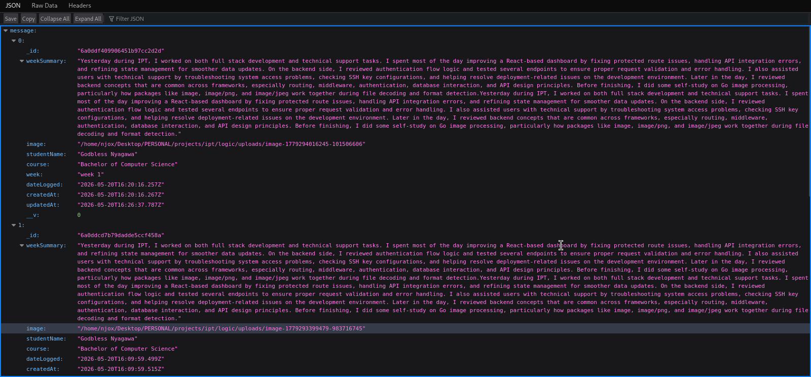
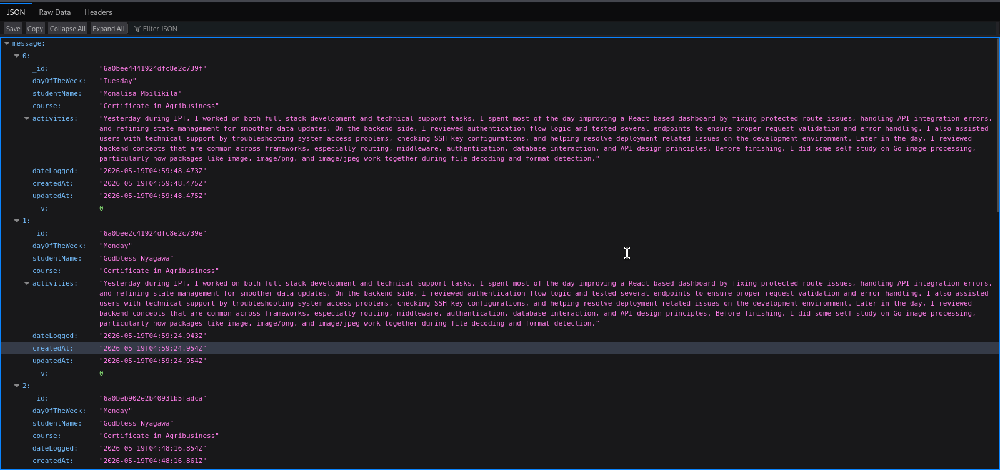
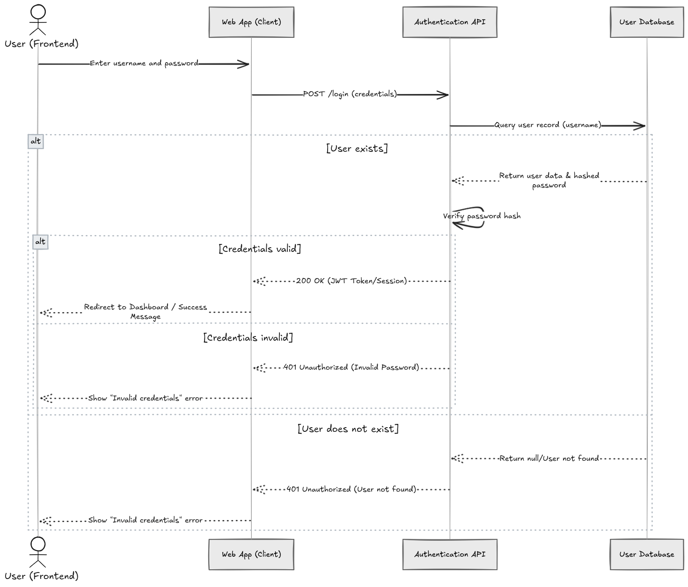

<!-- Animated README.md for Digital Logbook System Documentation -->

<!-- Header with Animation -->
<p align="center">
  
</p>

---

<!-- Introduction -->

## Welcome to Digital Logbook System Documentation!

Welcome to the official documentation repository for the Digital Logbook System. This repository contains comprehensive guides and resources for using and contributing to the system.

---

<!-- Table of Contents -->

## Table of Contents

- [Introduction](#introduction)
- [Getting Started](#getting-started)
- [System Requirements](#system-requirements)
- [User Guide](#user-guide)
- [Administrator Guide](#administrator-guide)
- [API Documentation](#api-documentation)
- [FAQs](#faqs)
- [Support](#support)

---

<!-- About -->

## About the Digital Logbook System

The Digital Logbook System is designed to streamline the Industrial Practical Training (IPT) process by providing an online platform for students, supervisors, and administrators to manage and track practical training activities.

---

<!-- Get Involved -->

## Get Involved

We welcome contributions from the community! If you have ideas, suggestions, or want to report issues, please visit our [GitHub repository](https://github.com/Njoxpy/Project-Docs-IPT).

---

## Installation

- Install MkDocs,You can install MkDocs using pip (Python package manager). Open your terminal and run:

  ```sh
  pip install mkdocs
  ```

  ## Run Locally
  - To preview your documentation as you work on it, you can serve it locally. From your project directory, run:

    ```sh
    mkdocs serve
    ```

  ## Deploy Documentation
  - Once you're ready to deploy your documentation, you can build the static site by running:
  -

  ```sh
  mkdocs build
  ```

  ```sh
  mkdocs gh-deploy
  ```

## Logic





## Docs



<!-- Footer -->
<p align="center">
  
</p>

<p align="center">
  &copy; 2024 NjoxPy. All rights reserved.
</p>
